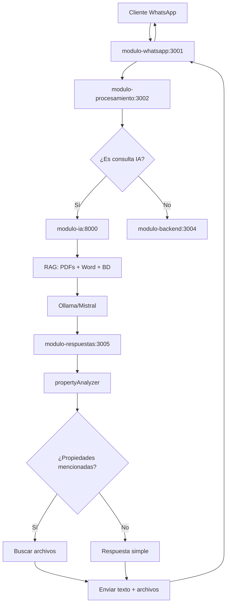

# 🔄 FLUJO CLIENTE → IA → AGENTE

Documentación completa del flujo de consultas inmobiliarias con IA integrada.

## 📋 RESUMEN DEL FLUJO

```
1. CLIENTE → WhatsApp → modulo-whatsapp
2. modulo-whatsapp → modulo-procesamiento (detecta consulta)  
3. modulo-procesamiento → modulo-ia (si es consulta inmobiliaria)
4. modulo-ia → respuesta RAG → modulo-respuestas
5. modulo-respuestas → analiza propiedades + archivos
6. modulo-respuestas → modulo-whatsapp → CLIENTE
```

---

## 🏗️ ARQUITECTURA DE MÓDULOS

### **modulo-whatsapp** (Puerto 3001)
- **Función**: Interfaz WhatsApp Web
- **Servicios**: `messageProcessor.js`, `multiSessionManager.js`
- **Responsabilidad**: Recibir/enviar mensajes WhatsApp

### **modulo-procesamiento** (Puerto 3002)  
- **Función**: Clasificar y enrutar mensajes
- **Servicios**: `messageAnalyzer.js`, `systemRouter.js`
- **Responsabilidad**: Detectar consultas IA vs comandos sistema

### **modulo-ia** (Puerto 8000)
- **Función**: Sistema RAG unificado
- **Tecnología**: FastAPI + sentence-transformers + FAISS
- **Responsabilidad**: Procesar consultas inmobiliarias

### **modulo-respuestas** (Puerto 3005)
- **Función**: Procesar respuestas y archivos  
- **Servicios**: `responseService.js`, `propertyAnalyzer.js`
- **Responsabilidad**: Analizar propiedades + enviar archivos

---

## 📱 FLUJO DETALLADO PASO A PASO

### **1. CLIENTE ENVÍA CONSULTA**
```
Cliente: "Hola, busco una casa en zona norte"
↓
WhatsApp Web → modulo-whatsapp
```

**Archivos involucrados:**
- `modulo-whatsapp/src/services/messageProcessor.js`
- Método: `processClientMessage()`

### **2. ANÁLISIS Y CLASIFICACIÓN**
```
modulo-whatsapp → modulo-procesamiento
↓
messageAnalyzer.analyzeMessage()
```

**Proceso:**
1. **Validar usuario**: ¿Es agente del sistema?
2. **Clasificar mensaje**: ¿Es consulta inmobiliaria? 
3. **Análisis IA**: Detectar palabras clave, intención

**Archivos involucrados:**
- `modulo-procesamiento/src/services/messageAnalyzer.js`
- Método: `analyzeClientQuery()`

**Palabras clave detectadas:**
- Tipos: casa, departamento, terreno
- Operaciones: venta, alquiler, compra
- Ubicaciones: zona norte, sur, centro
- Intenciones: precio, información, visita

### **3. ENVÍO A MÓDULO IA**
```
if (analysis.requiresIA) {
  systemRouter.sendToIA(queryData)
}
```

**Proceso:**
1. **Preparar consulta** para módulo IA
2. **Enviar POST** a `/api/query`
3. **Procesar respuesta** RAG

**Archivos involucrados:**
- `modulo-procesamiento/src/services/systemRouter.js`
- Método: `sendToIA()`

### **4. PROCESAMIENTO RAG**
```
modulo-ia/app.py → POST /api/query
↓
ask_mistral_with_context(query)
```

**Proceso RAG:**
1. **Vectorización**: Convertir consulta a embedding
2. **Búsqueda FAISS**: Encontrar documentos similares
3. **Contexto**: PDFs + Word + Propiedades BD
4. **Generación**: Ollama/Mistral + contexto
5. **Análisis interés**: Detectar "coordinar cita"

**Archivos involucrados:**
- `modulo-ia/app.py` - Endpoint principal
- `modulo-ia/app/services/ia_service.py` - Lógica RAG
- `modulo-ia/app/services/embedding_service.py` - Vectorización

**Fuentes de datos RAG:**
- `data/pdfs/` - Documentos PDF
- `data/docs/` - Documentos Word (.docx)
- Base de datos PostgreSQL - Propiedades

### **5. ANÁLISIS DE PROPIEDADES**
```
modulo-respuestas → propertyAnalyzer.analyzeIAResponse()
```

**Proceso:**
1. **Detectar propiedades** mencionadas en respuesta
2. **Buscar archivos** asociados (fotos, planos)
3. **Verificar interés** del cliente
4. **Enriquecer respuesta** con multimedia

**Archivos involucrados:**
- `modulo-respuestas/src/services/propertyAnalyzer.js`
- `modulo-respuestas/src/services/responseService.js`

### **6. ENVÍO FINAL AL CLIENTE**
```
modulo-respuestas → modulo-whatsapp → Cliente
```

**Proceso:**
1. **Preparar mensaje** con texto + archivos
2. **Enviar WhatsApp Web**
3. **Guardar conversación** en BD
4. **Notificar agente** si requiere atención

---

## 🔧 CONFIGURACIÓN NECESARIA

### **Variables de entorno (.env)**
```bash
# Módulo IA
IA_PORT=8000
IA_HOST=0.0.0.0
EMBEDDING_MODEL_NAME=distiluse-base-multilingual-cased-v1

# URLs de módulos
IA_URL=http://localhost:8000
PROCESSING_URL=http://localhost:3002
RESPONSES_URL=http://localhost:3005
WHATSAPP_PORT=3001

# Base de datos
DB_HOST=localhost
DB_PORT=5432
DB_NAME=dbremax
DB_USER=postgres
DB_PASSWORD=postgre

# Ollama
OLLAMA_API_URL=http://localhost:11434/api/generate
OLLAMA_MODEL_NAME=mistral
```

### **Estructura de archivos**
```
data/
├── docs/          # Documentos Word (.docx)
├── pdfs/          # Documentos PDF (.pdf)
└── vector_db/     # Índices FAISS + embeddings
    ├── index.faiss
    └── docs.pkl

modulo-respuestas/uploads/
└── properties/    # Archivos por propiedad
    ├── 1/         # Propiedad ID 1
    ├── 2/         # Propiedad ID 2
    └── ...
```

---

## 🚀 INICIALIZACIÓN DEL SISTEMA

### **1. Preparar RAG**
```bash
cd modulo-ia
python scripts/create_index.py  # Crear índice unificado
```

### **2. Iniciar servicios (orden importante)**
```bash
# Terminal 1: Base de datos
cd modulo-base-datos && npm start

# Terminal 2: IA
cd modulo-ia && python app.py

# Terminal 3: Procesamiento  
cd modulo-procesamiento && npm start

# Terminal 4: Respuestas
cd modulo-respuestas && npm start

# Terminal 5: WhatsApp
cd modulo-whatsapp && npm start

# Terminal 6: Ollama
ollama run mistral
```

---

## 📊 EJEMPLOS DE CONSULTAS

### **Consulta básica**
```
Cliente: "Hola, busco departamentos en venta"
↓
IA: "¡Hola! Soy Remaxi. Tengo departamentos disponibles en venta:
1. Departamento Moderno - Zona Norte - $85,000
2. Departamento Familiar - Centro - $95,000
¿Te interesa coordinar una cita para ver alguno?"
```

### **Consulta específica**
```
Cliente: "Quiero información sobre casas en zona sur con 3 dormitorios"
↓ 
IA: "Encontré estas casas en zona sur con 3 dormitorios:
1. Casa Familiar Sur - $120,000 - 3 dorm, 2 baños
📎 [Adjunta fotos y planos]
¿Te gustaría agendar una visita?"
```

### **Activación de agente**
```
Cliente: "Me interesa mucho, quiero coordinar una cita"
↓
Sistema: ⚠️ CLIENTE INTERESADO - Requiere atención del agente
↓
Agente recibe notificación para contactar cliente
```

---

## 🔍 DETECCIÓN DE CONSULTAS IA

### **Palabras clave que activan IA:**
- **Tipos**: casa, departamento, terreno, propiedad
- **Operaciones**: venta, alquiler, compra, renta  
- **Ubicaciones**: zona norte/sur, centro, barrio
- **Características**: dormitorios, baños, garage
- **Precios**: cuánto, precio, costo, valor
- **Interés**: información, detalles, mostrar, ver

### **Umbral de activación:**
- **2+ palabras clave**: Alta confianza → IA
- **1 palabra clave**: Media confianza → IA  
- **Solo saludo**: Baja confianza → IA (respuesta amigable)
- **Sin palabras clave**: No IA → Backend normal

---

## 📈 ANÁLISIS DE PROPIEDADES

### **Detección automática:**
1. **Referencias directas**: "Propiedad #123", "PROP001"
2. **Por ubicación**: "casas en zona norte"  
3. **Por tipo**: "departamentos para venta"

### **Archivos sugeridos:**
- Fotos de la propiedad
- Planos arquitectónicos  
- Documentos legales
- Videos de recorrido

### **Activación de agente:**
- Frases: "coordinar cita", "agendar", "me interesa"
- Múltiples preguntas sobre misma propiedad
- Solicitud de información detallada

---

## 🛠️ TROUBLESHOOTING

### **Problemas comunes:**

#### **IA no responde**
```bash
# Verificar Ollama
curl http://localhost:11434/api/generate

# Verificar módulo IA  
curl http://localhost:8000/api/health

# Logs
cd modulo-ia && python app.py
```

#### **No detecta consultas**
- Verificar palabras clave en `messageAnalyzer.js`
- Revisar logs de `modulo-procesamiento`
- Comprobar umbral de detección

#### **No encuentra propiedades**
- Verificar índice RAG: `python test_unified_rag.py`
- Revisar conexión BD en módulo-ia
- Recrear índice: `python scripts/create_index.py`

#### **No envía archivos**
- Verificar directorio `uploads/properties/`
- Comprobar permisos de archivos
- Revisar logs de `propertyAnalyzer.js`

---

## 📋 CHECKLIST DE FUNCIONAMIENTO

### **✅ Pre-requisitos:**
- [ ] PostgreSQL con propiedades cargadas
- [ ] Ollama corriendo con modelo Mistral
- [ ] Índice RAG creado (`docs.pkl` existe)
- [ ] Documentos en `data/docs/` y `data/pdfs/`

### **✅ Pruebas básicas:**
- [ ] `curl localhost:8000/api/health` → status: healthy
- [ ] `curl localhost:3002/api/health` → success: true
- [ ] `curl localhost:3005/api/health` → success: true
- [ ] WhatsApp Web autenticado y conectado

### **✅ Prueba completa:**
- [ ] Cliente envía: "Hola, busco casas"
- [ ] Sistema detecta consulta IA
- [ ] IA responde con propiedades  
- [ ] Se adjuntan archivos si existen
- [ ] Conversación se guarda en BD

---

## 🔄 FLUJO DE DATOS TÉCNICO



---

**Sistema implementado exitosamente** ✅  
**Flujo cliente → IA → agente funcionando** 🎯  
**RAG unificado: PDFs + Word + BD** 📚  
**Detección automática de interés** 🔍  
**Archivos adjuntos automáticos** 📎